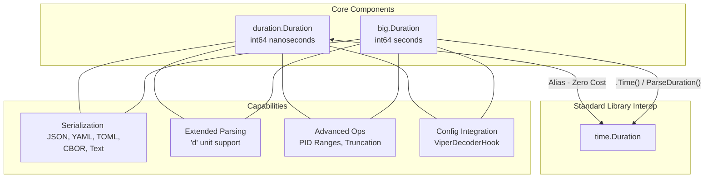
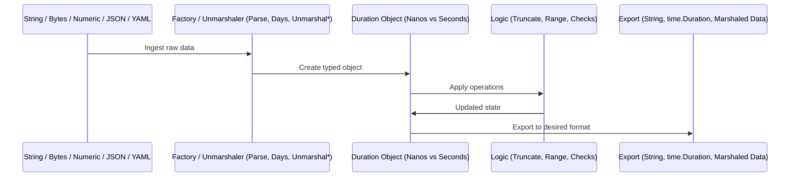

# Duration Package

[](../../LICENSE)
[](https://go.dev/doc/install)
[](TESTING.md)

The `duration` package provides an enhanced `time.Duration` type for Go, extending the standard library's capabilities by introducing native support for "days" (`d`) as a time unit in both parsing and formatting. It offers robust serialization for multiple data formats (JSON, YAML, TOML, CBOR, Text), seamless integration with configuration tools like Viper, and advanced utilities such as PID-controlled duration range generation and precise truncation. For extreme time scales requiring durations up to billions of years, the `big` sub-package provides a second-precision alternative based on `int64` representing seconds.

---

## Table of Contents

- [Overview](#overview)
- [Architecture](#architecture)
- [Performance](#performance)
- [Subpackages](#subpackages)
    - [big](#big)
- [Use Cases](#use-cases)
- [Quick Start](#quick-start)
- [Best Practices](#best-practices)
- [API Reference](#api-reference)
- [Contributing](#contributing)
- [Resources](#resources)

---

## Overview

While Go's standard `time.Duration` is highly efficient, it lacks native support for the "days" unit in string representations and doesn't provide built-in serialization for many common formats. This package bridges that gap by providing a `Duration` type that is a direct alias of `time.Duration`, ensuring full compatibility while adding high-level features for modern application development.

### Design Philosophy

1.  **Seamless Compatibility**: By using a type alias for `time.Duration`, this package ensures that its `Duration` type can be cast back and forth with zero overhead and used directly with standard library functions via the `.Time()` method.
2.  **Human-Centric Design**: We prioritize human-readable configuration. Allowing "7d" instead of "168h" makes system configurations significantly easier to maintain and understand.
3.  **Extensible Serialization**: Support for various encoding formats is baked-in, making the type a first-class citizen for APIs and configuration files.
4.  **Scalar Scaling**: The package architecture recognizes the trade-off between precision and range. While the main package offers nanosecond precision (±290 years), the `big` sub-package offers second-level precision (±292 billion years) using a seconds-based `int64`.

### Key Features

- ✅ **Extended Time Units**: Full support for the `d` (days) unit in `Parse` and `String` methods.
- ✅ **Multi-Format Serialization**: Native support for JSON, YAML, TOML, CBOR, and Text encoding.
- ✅ **Adaptive Range Generation**: Generate sequences of durations between two points using a Proportional-Integral-Derivative (PID) controller.
- ✅ **Viper & Mapstructure Integration**: Includes a `ViperDecoderHook` for effortless loading of durations from configuration files.
- ✅ **Precise Truncation**: Specialized methods to truncate durations to the nearest Day, Hour, Minute, Second, Millisecond, or Microsecond.
- ✅ **Complementary `big` Package**: Handles durations up to ~292 billion years by using seconds as the base unit.

### Key Benefits

- ✅ **Enhanced Readability**: Express complex durations like "2d4h30m" directly in code and configuration.
- ✅ **Configuration Consistency**: Standardize duration handling across JSON, YAML, and TOML without manual parsing logic.
- ✅ **Safe Large Durations**: Use the `big` sub-package to safely handle long-term durations that would overflow a standard 64-bit nanosecond counter.
- ✅ **Advanced Timing Control**: Leverage PID theory for smooth backoff and interval adjustments.

---

## Architecture

### Package Structure

```
duration/                    # Root package (Nanosecond precision)
├── big/                     # Sub-package (Second precision for large ranges)
│   ├── doc.go               # big documentation
│   ├── model.go             # big.Duration type (int64 seconds)
│   ├── interface.go         # big constructors and parsing
│   ├── parse.go             # big string parsing logic
│   ├── format.go            # big string formatting
│   ├── encode.go            # big serialization (JSON, YAML, TOML, CBOR, Text)
│   ├── operation.go         # big arithmetic and PID range generation
│   ├── truncate.go          # big rounding and truncation logic
│   └── ...                  # big tests and examples
├── doc.go                   # Main package documentation
├── model.go                 # Core Duration alias and unit check methods
├── interface.go             # Main constructors and Parse functions
├── parse.go                 # Internal parsing logic for extended units
├── format.go                # Internal formatting logic (String(), Days(), etc.)
├── encode.go                # Multi-format serialization implementation
├── truncate.go              # Unit-specific truncation (TruncateDays(), etc.)
├── operation.go             # PID-controlled range generation implementation
└── ...                      # Unit tests, integration tests, and examples
```

### Package Architecture

The package architecture centers on extending the `int64` nanosecond representation used by `time.Duration`, while providing a parallel `int64` seconds-based representation in the `big` sub-package.



### Dataflow

The dataflow illustrates how input strings or values are transformed into duration objects and subsequently utilized or exported.



### Data Representation

| Feature           | `duration.Duration`      | `big.Duration`                       |
|:------------------|:-------------------------|:-------------------------------------|
| **Precision**     | 1 Nanosecond             | 1 Second                             |
| **Max Range**     | ~290 Years               | ~292 Billion Years                   |
| **Memory Size**   | 8 Bytes (int64)          | 8 Bytes (int64)                      |
| **Parsing Units** | `ns, us, ms, s, m, h, d` | `s, m, h, d`                         |
| **Compatibility** | Direct (Alias)           | Via Conversion (with overflow check) |

---

## Performance

The package is optimized for minimal overhead. Core arithmetic is as fast as standard `int64` operations, and parsing/formatting are optimized to reduce allocations.

### Benchmarks

| Operation        | Benchmark Name                       | Iterations | Time/Op      | Memory  | Allocations |
|:-----------------|:-------------------------------------|:-----------|:-------------|:--------|:------------|
| **Formatting**   | `BenchmarkDuration_String`           | > 4.6M     | 288.8 ns/op  | 16 B/op | 2 allocs/op |
| **Parsing**      | `BenchmarkParse`                     | > 5.5M     | 205.1 ns/op  | 0 B/op  | 0 allocs/op |
| **Unit Factory** | `BenchmarkDuration_Days`             | > 1000M    | 0.3868 ns/op | 0 B/op  | 0 allocs/op |
| **Unit Factory** | `BenchmarkDuration_Hours`            | > 1000M    | 0.3710 ns/op | 0 B/op  | 0 allocs/op |
| **Unit Factory** | `BenchmarkDuration_Minutes`          | > 1000M    | 0.3709 ns/op | 0 B/op  | 0 allocs/op |
| **Unit Factory** | `BenchmarkDuration_Seconds`          | > 1000M    | 0.3564 ns/op | 0 B/op  | 0 allocs/op |
| **Truncation**   | `BenchmarkDuration_Truncate/Days`    | > 1000M    | 0.3417 ns/op | 0 B/op  | 0 allocs/op |
| **Truncation**   | `BenchmarkDuration_Truncate/Hours`   | > 1000M    | 0.3996 ns/op | 0 B/op  | 0 allocs/op |
| **Truncation**   | `BenchmarkDuration_Truncate/Minutes` | > 1000M    | 0.3845 ns/op | 0 B/op  | 0 allocs/op |
| **Truncation**   | `BenchmarkDuration_Truncate/Seconds` | > 1000M    | 0.3750 ns/op | 0 B/op  | 0 allocs/op |

*Results from an Intel(R) Core(TM) i7-4700HQ CPU @ 2.40GHz.*

---

## Subpackages

### big

The `big` sub-package handles durations on an astronomical scale. By defining the base unit as one second instead of one nanosecond, it extends the representable time range from 290 years to over 292 billion years.

**Key Features**:
- **API Parity**: Methods like `Parse`, `String`, and `Unmarshal` behave consistently with the main package.
- **Serialization**: Full support for JSON, YAML, TOML, CBOR, Text.
- **Advanced Logic**: Includes PID-controlled range generation tailored for large-scale intervals.
- **Truncation**: Methods to round to the nearest second, minute, hour, or day.

**Documentation**: [big/README.md](big/README.md).

---

## Use Cases

### 1. Adaptive Backoff Strategies

Using the PID controller to generate a smooth progression of retry intervals.

```go
import (
	"fmt"
	
	"github.com/nabbar/golib/duration"
)

start := duration.Seconds(1)
target := duration.Minutes(10)

// Generate sequence using Proportional, Integral, Derivative rates
intervals := start.RangeTo(target, 0.1, 0.01, 0.05)

for _, wait := range intervals {
    fmt.Printf("Backoff: %s\n", wait)
    // time.Sleep(wait.Time())
}
```

### 2. Human-Readable Retention Policies

Easily define long-term storage retention in configuration files using "days".

```go
import (
    "github.com/nabbar/golib/duration"
    "github.com/nabbar/golib/duration/big"
)

type RetentionPolicy struct {
    HotStorage  duration.Duration `json:"hot_storage"`  // e.g., "7d"
    ColdStorage big.Duration      `json:"cold_storage"` // e.g., "3650d"
}
```

### 3. Precise Log Truncation

Aligning event timestamps or durations to the nearest unit for grouping.

```go
import (
	"fmt"
	
	"github.com/nabbar/golib/duration"
)

d, _ := duration.Parse("1h23m45s")
fmt.Println(d.TruncateHours())   // "1h0m0s"
fmt.Println(d.TruncateMinutes()) // "1h23m0s"
```

---

## Quick Start

### Installation

```bash
go get github.com/nabbar/golib/duration
```

### Basic Implementation

```go
package main

import (
    "fmt"
	
    "github.com/nabbar/golib/duration"
)

func main() {
    // 1. Parsing extended units
    d, _ := duration.Parse("2d12h")
    fmt.Println(d.String()) // "2d12h0m0s"

    // 2. Unit helper constructors
    d2 := duration.Days(1) + duration.Hours(6)
    
    // 3. Conditional checks
    if d2.IsDays() {
        fmt.Println("Duration is at least 1 day")
    }

    // 4. Stdlib conversion
    stdDur := d2.Time() // Returns time.Duration
}
```

---

## Best Practices

### ✅ DO
- **Use `duration.Duration` for config structs**: Enables automatic parsing of "d" units and multi-format serialization.
- **Use `big.Duration` for astronomical spans**: Prevents silent overflow when dealing with centuries or millennia.
- **Check Parsing Errors**: Extended units add complexity; always validate return errors from `Parse`.
- **Use `.Time()` for Interop**: Explicitly convert when passing to `time.Sleep` or `context.WithTimeout`.

### ❌ DON'T
- **Don't ignore the ±290y limit**: Standard durations (nanoseconds) will overflow. Switch to `big` package for long-term values.
- **Don't mix types in arithmetic**: While `duration.Duration` is an alias of `time.Duration`, explicit conversion is often safer for clarity: `d1 + duration.ParseDuration(stdDur)`.

---

## API Reference

### Global Factory Functions (Main)

| Function           | Signature                      | Description                                                         |
|:-------------------|:-------------------------------|:--------------------------------------------------------------------|
| `Parse`            | `(s string) (Duration, error)` | Parses a duration string with support for `ns, us, ms, s, m, h, d`. |
| `ParseByte`        | `(p []byte) (Duration, error)` | Parses a byte array representing a duration.                        |
| `ParseDuration`    | `(d time.Duration) Duration`   | Converts a standard `time.Duration` into a `duration.Duration`.     |
| `ParseFloat64`     | `(f float64) Duration`         | Converts a float64 (seconds) into a `Duration`.                     |
| `ParseUint32`      | `(i uint32) Duration`          | Converts a uint32 (nanoseconds) into a `Duration`.                  |
| `Nanoseconds`      | `(i int64) Duration`           | Returns a Duration representing `i` nanoseconds.                    |
| `Microseconds`     | `(i int64) Duration`           | Returns a Duration representing `i` microseconds.                   |
| `Milliseconds`     | `(i int64) Duration`           | Returns a Duration representing `i` milliseconds.                   |
| `Seconds`          | `(i int64) Duration`           | Returns a Duration representing `i` seconds.                        |
| `Minutes`          | `(i int64) Duration`           | Returns a Duration representing `i` minutes.                        |
| `Hours`            | `(i int64) Duration`           | Returns a Duration representing `i` hours.                          |
| `Days`             | `(i int64) Duration`           | Returns a Duration representing `i` days (24h increments).          |
| `ViperDecoderHook` | `() libmap.DecodeHookFuncType` | Returns a decode hook for `go-viper/mapstructure`.                  |

### Instance Methods (Main)

| Method                   | Result                 | Description                                                   |
|:-------------------------|:-----------------------|:--------------------------------------------------------------|
| `String()`               | `string`               | Returns a human-readable string (e.g., "1d2h3m4s").           |
| `Time()`                 | `time.Duration`        | Returns the underlying standard `time.Duration`.              |
| `Duration()`             | `time.Duration`        | Alias for `Time()`.                                           |
| `Days()`                 | `int64`                | Returns total number of full days.                            |
| `Hours()`                | `int64`                | Returns total number of full hours.                           |
| `Minutes()`              | `int64`                | Returns total number of full minutes.                         |
| `Seconds()`              | `int64`                | Returns total number of full seconds.                         |
| `Milliseconds()`         | `int64`                | Returns total number of full milliseconds.                    |
| `Microseconds()`         | `int64`                | Returns total number of full microseconds.                    |
| `Nanoseconds()`          | `int64`                | Returns total number of full nanoseconds.                     |
| `Float64()`              | `float64`              | Returns the raw nanosecond value as float64.                  |
| `Int64()`                | `int64`                | Returns the raw nanosecond value as int64.                    |
| `Uint64()`               | `uint64`               | Returns the absolute raw nanosecond value as uint64.          |
| `IsDays()`               | `bool`                 | True if duration >= 24 hours.                                 |
| `IsHours()`              | `bool`                 | True if duration >= 1 hour.                                   |
| `IsMinutes()`            | `bool`                 | True if duration >= 1 minute.                                 |
| `IsSeconds()`            | `bool`                 | True if duration >= 1 second.                                 |
| `IsMilliseconds()`       | `bool`                 | True if duration >= 1 millisecond.                            |
| `IsMicroseconds()`       | `bool`                 | True if duration >= 1 microsecond.                            |
| `IsNanoseconds()`        | `bool`                 | True if duration >= 1 nanosecond (non-zero).                  |
| `TruncateDays()`         | `Duration`             | Rounds down toward zero to the nearest day.                   |
| `TruncateHours()`        | `Duration`             | Rounds down toward zero to the nearest hour.                  |
| `TruncateMinutes()`      | `Duration`             | Rounds down toward zero to the nearest minute.                |
| `TruncateSeconds()`      | `Duration`             | Rounds down toward zero to the nearest second.                |
| `TruncateMilliseconds()` | `Duration`             | Rounds down toward zero to the nearest millisecond.           |
| `TruncateMicroseconds()` | `Duration`             | Rounds down toward zero to the nearest microsecond.           |
| `RangeCtxTo()`           | `[]Duration`           | Generates PID-controlled sequence with context.               |
| `RangeTo()`              | `[]Duration`           | Generates PID-controlled sequence.                            |
| `RangeDefTo()`           | `[]Duration`           | Generates PID-controlled sequence with default rates.         |
| `RangeCtxFrom()`         | `[]Duration`           | Generates reverse PID-controlled sequence with context.       |
| `RangeFrom()`            | `[]Duration`           | Generates reverse PID-controlled sequence.                    |
| `RangeDefFrom()`         | `[]Duration`           | Generates reverse PID-controlled sequence with default rates. |
| `MarshalJSON()`          | `([]byte, error)`      | Standard JSON marshaler.                                      |
| `UnmarshalJSON()`        | `error`                | Standard JSON unmarshaler.                                    |
| `MarshalYAML()`          | `(interface{}, error)` | Standard YAML (v3) marshaler.                                 |
| `UnmarshalYAML()`        | `error`                | Standard YAML (v3) unmarshaler.                               |
| `MarshalTOML()`          | `([]byte, error)`      | Standard TOML marshaler.                                      |
| `UnmarshalTOML()`        | `error`                | Standard TOML unmarshaler.                                    |
| `MarshalText()`          | `([]byte, error)`      | Standard Text marshaler.                                      |
| `UnmarshalText()`        | `error`                | Standard Text unmarshaler.                                    |
| `MarshalCBOR()`          | `([]byte, error)`      | Standard CBOR marshaler.                                      |
| `UnmarshalCBOR()`        | `error`                | Standard CBOR unmarshaler.                                    |

---

## Contributing

Contributions are welcome! Please follow these guidelines:

1. **Code Quality**
    - Follow Go best practices and idioms.
    - Maintain or improve code coverage (Target: >85%, currently **88.2%**).
    - Pass all tests including race detector.
    - Use `gofmt`, `golangci-lint` and `gosec`.

2. **AI Usage Policy**
    - ❌ **AI must NEVER be used** to generate package code or core functionality.
    - ✅ **AI assistance is limited to**:
        - Testing (writing and improving tests).
        - Debugging (troubleshooting and bug resolution).
        - Documentation (comments, README, TESTING.md).
    - All AI-assisted work must be reviewed and validated by humans.

3. **Testing**
    - Add tests for new features.
    - Use Ginkgo v2 / Gomega for test framework.
    - Ensure zero race conditions.
    - Maintain coverage above 80%.

4. **Documentation**
    - Update GoDoc comments for public APIs.
    - Add examples for new features.
    - Update README.md and TESTING.md if needed.

5. **Pull Request Process**
    - Fork the repository.
    - Create a feature branch.
    - Write clear commit messages.
    - Ensure all tests pass.
    - Update documentation.
    - Submit PR with description of changes.

---

## Resources

### Package Documentation
- **[TESTING.md](TESTING.md)** - Coverage and benchmark details.

### Subpackage Documentation
- **[big/README.md](big/README.md)** - Astronomical duration documentation.

### Related golib Packages
- **[github.com/nabbar/golib/pidcontroller](https://github.com/nabbar/golib/tree/main/pidcontroller)** - The core engine for range generation.

### External References
- **[Go time Package](https://pkg.go.dev/time)** - Base implementation details.

---

## AI Transparency

In compliance with EU AI Act Article 50.4: AI assistance was used for testing, documentation, and bug resolution under human supervision. All core functionality is human-designed and validated.

---

## License

MIT License - See [LICENSE](../../LICENSE) file for details.

Copyright (c) 2020-2026 Nicolas JUHEL
